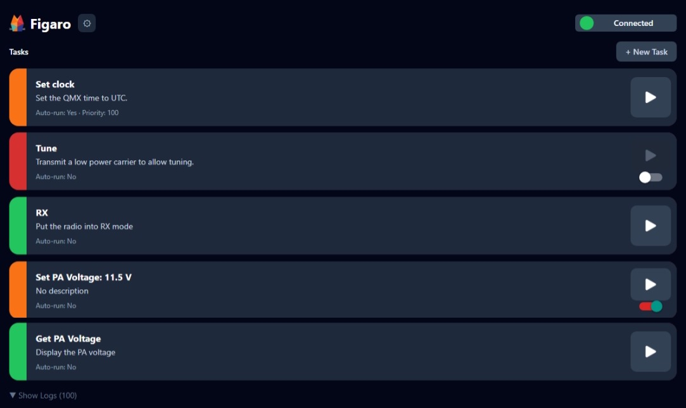

  

  <h1>Figaro</h1>

  
<strong>CAT command task automation for the QMX transceiver</strong>

  

  

    
    
    
  
            
    

---

Figaro is a free app for ham radio operators. It lets you write, manage, and run reusable **CAT command scripts** against a connected [QMX transceiver](https://www.qrp-labs.com/qmx.html) — automating repetitive radio tasks with a single tap.

---

---
# WARNING

Figaro is a labour of love, no warranty, implied or express is provided.

The only intelligence involved in deciding if a series of CAT commands are safe 
to run on your radio is yours.

Likewise, scripts found in the community library are a convenience tool to share
 user's scripts.  You should ensure that you are comfortable with them before 
 installing or executing.

Be aware also, that the CAT API may change between firmware versions.  Review 
your scripts in conjunction with planned firmware updates.

That out of the way, let's explore Figaro.

# Availability:

Whilst an iOS build is in the pipeline, not having a mac to develop against does make it a little tough.

## Features

### Reusable Task Scripts
Write tasks in plain JavaScript. Each task is a named, stored script you can run 
on demand or trigger automatically on connection.

Download from the community library, or create your own custom script.

### Auto-Run on Connect
Mark any task to run automatically every time a successful connection is 
established — perfect for tasks like setting the clock or restoring operating 
defaults.

### Fully Local — No Account Required
All tasks, settings, and execution history are stored on-device only. No cloud 
account, no sign-in, no sync.

---

## Documentation and Guides

- [Interface overview](docs/interface.md)
- [Settings](docs/settings.md)
- [Scripting guide](docs/scripts.md)
- [Contributing new scripts](docs/scripts.md)

---

## Platform Support

| Platform | Status |
|---|---|
| Android | ✅ Available on Google Play |
| iOS | Planned |
| Web | ✅ Available at  |

---
