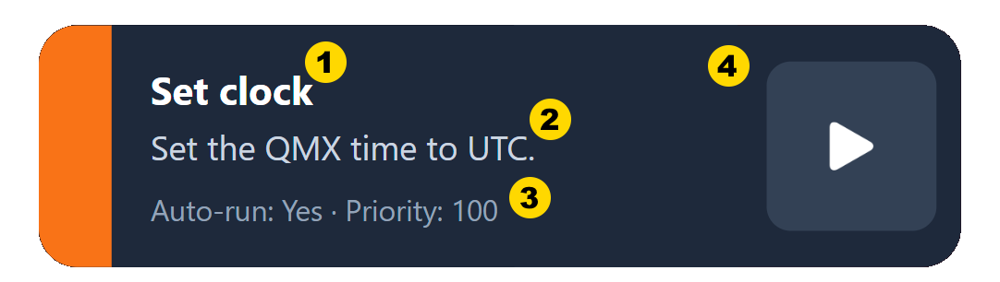
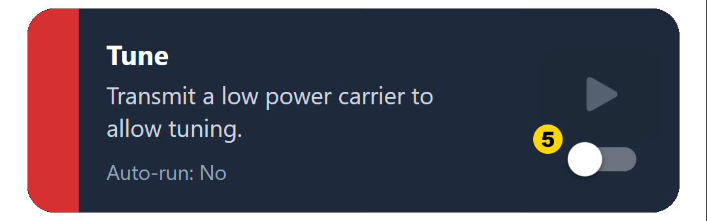
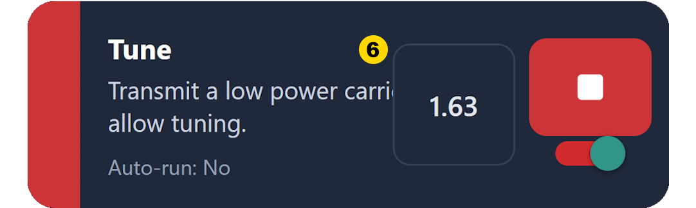
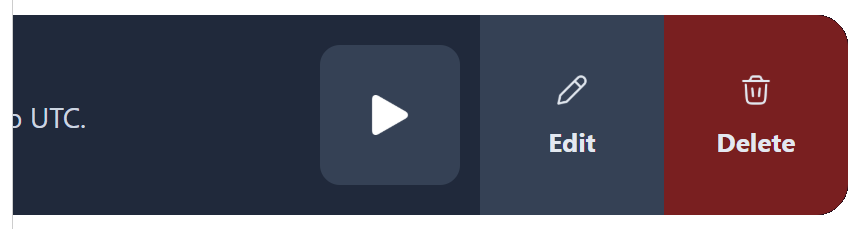
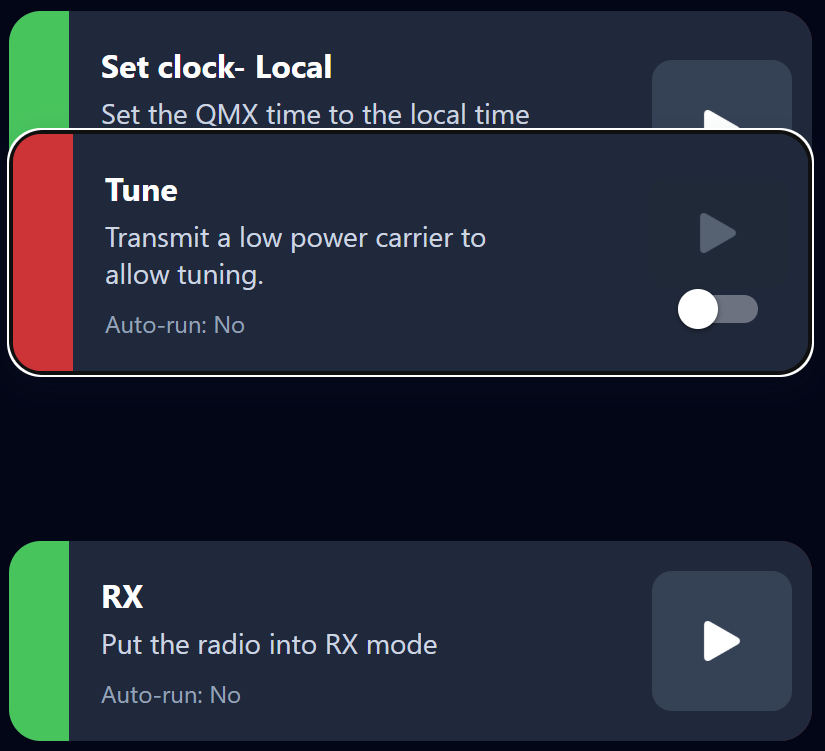
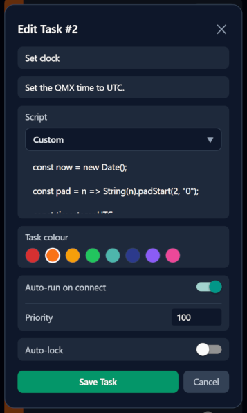

#  Figaro Interface Guide

This page explains the Fargo user interface.

## Anatomy of a task

1. Title
2. Description
3. Auto-run state.  If enabled, the priority is also displayed.
4. Task run button.  This is where the action is, tap it and watch Fargo and your QMX dance.
5. If a task is configured to auto-lock, it must be armed first, to enable execution.  This reduces the likelihood of it being run accidently. 
6. If the task outputs values, a text-box will appear displaying any values.  
In this instance, the current SWR.

## Edit or Delete

The edit and delete options may be accessed by swiping a task left.  On Web, 
right click the task.

## Re-order

To re-order, hold a task, and move it to the preferred location.

## New task dialog

### Script

The script allows you to select either an existing script from the community library, or create your own [custom script](scripts.md).  

When loading a script from the library, ensure that you've reviewed the script first and are comfortable with its operation.  Scripts my be viewed in the [script library respsitory](https://github.com/RhinoLance/figaro-community/tree/main/script-library).

### Task colour

Choose a colour to tag the task for visual grouping.

### Auto-run on connect

Tag the task to run as soon as the a connection to the radio is established.

#### Priority

If Auto-run is enabled, the priority determines the order in which Auto-run tasks will execute.

### Auto-lock

If enabled, the task must be armed before it may be run.  This is usefull for preventing accidental execution of tasks.  

**Note** that this is a UI lock only.  If both Auto-run and Auto-lock are both enabled, the script will still execute as Auto-run'able.

