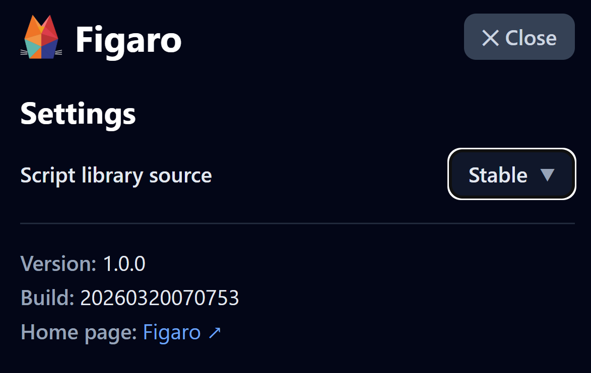

#  Figaro Settings Guide

This page documents the app settings used by Figaro.

## Script library source

This sets the source to load scripts from.  There are three options.

1.  **Stable**: Scripts are served from the Fargo community repositories *main* branch.
2.  **Development**: Scripts are served from the Fargo community repositories *develop* branch.  
Note that development scripts may be unstable and/or imcomplete.  As a general rule, unless you are involved in testing a new or updated script, you should use the *Stable* script library.
3.  **Custom**:  If you want to load scripts form your own library, just enter your URL.  Note that when loading the library, Figaro uses the [Github 
repository API](https://docs.github.com/en/rest/repos/contents?apiVersion=2026-03-10#get-repository-content), specifically the *contents* endpoint.  As long as you return a comparible json document referencing your files, you'll have no problem.  You may want to review the Figaro community's [endpoint](https://api.github.com/repos/RhinoLance/figaro-community/contents/script-library).
