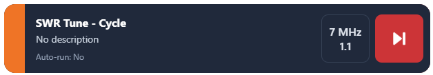

import RemoteCode from '@site/src/components/RemoteCode';
import ScriptPageHeader from '@site/src/components/ScriptPageHeader';
import Tabs from '@theme/Tabs';
import TabItem from '@theme/TabItem';

<ScriptPageHeader
  title="SWR Tune - Cycle"
  summary="Cycle through a list of frequencies, showing SWR for each."
  installLabel="Cycle through a list of frequencies, showing SWR for each."
  ftdFileName="swr-tune-cycle.json"
  reqFirmware="1.4.3"
/>

<Tabs
	defaultValue="overview"
	values={[
		{label: 'Overview', value: 'overview'},
		{label: 'Source Code', value: 'source'},
	]}>

<TabItem value="overview">

This task will cycle through a list of frequencies, pausing on each one 
where it
puts the radio into SWR mode and displays the SWR.  Press the play/pause 
button to advance to the next frequency.



### Configuration

Frequencies may be defined in one of two places, the script itself, or in one of 
the radio's message slots.

#### Defining frequencies in the script
- At the top of the script, set the **FREQ_SRC** to `"SCRIPT"`;
- Edit the **FREQ_LIST** variable to contain the frequencies you wish to cycle 
through.

E.g. to cycle through 7.032 MHz, 14.044 MHz and 21.044 MHz.
```javascript
const FREQ_SRC = "SCRIPT"; // MSG | SCRIPT
const FREQ_LIST = [
	7032000,
	14044000,
	21044000
];
```

#### Definging frequencies in a message slot
- At the top of the script, set the **FREQ_SRC** to `"MSG";
- Edit the message slot to contain the frequencies you wish to cycle through.
This is most easily done via the radio's terminal.

E.g. to load frequencies from message slot 10.
```javascript
const FREQ_SRC = "MSG"; // MSG | SCRIPT
const MESSAGE_INDEX = 10;
```

The message slot should contain frequencies seperated by the pipe character `|`.  
For example, to cycle through 7.032 MHz, 14.044 MHz and 21.044 MHz, the message 
slot should contain `7032000|14044000|21044000`.

</TabItem>

<TabItem value="source">
	### Source
	<RemoteCode language="js" scriptLibraryFile="cycle-tune.js" />
</TabItem>

</Tabs>
