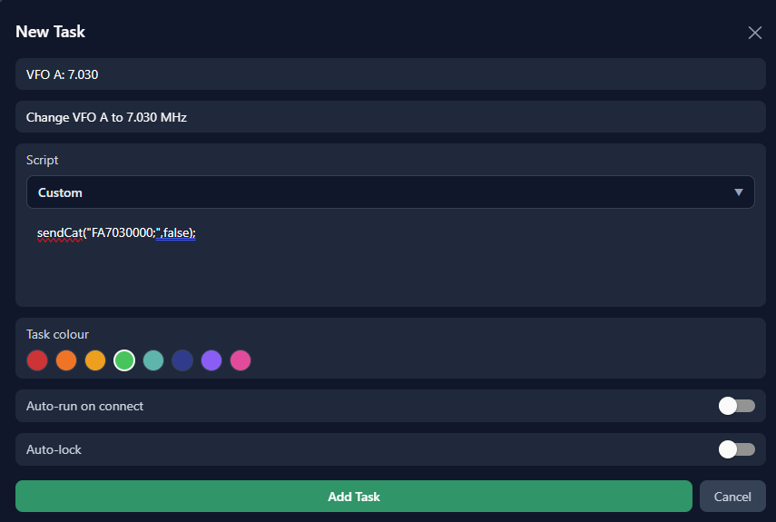

# Writing Data

This page will teach you how to write a command to your QMX.  We'll learn by 
setting VFO A to our favourite CW calling frequency.

## Setting the frequency

To set the frequency we first need to know the QMX's CAT command for setting
the frequency.  We do that by referencing the QMX's 
[CAT programming manual](https://qrp-labs.com/qmx.html).

### Finding the CAT command
Page 2 shows the following:

:::tip[FA: Get/Set VFO A]

Set: &nbsp;&nbsp;&nbsp;&nbsp; Sets VFO A value. Example: FA7030000; sets VFO A 
to 7.030MHz

Get: &nbsp;&nbsp;&nbsp;&nbsp; Returns the VFO A contents as an 11-digit number. 
Example: “FA;” returns “FA00007030000;”

:::

:::tip[FB: Get/Set VFO B]

Set: &nbsp;&nbsp;&nbsp;&nbsp; Sets VFO B value. Example: FB7016000; sets VFO B 
to 7.016MHz

Get: &nbsp;&nbsp;&nbsp;&nbsp; Returns the VFO B contents as an 11-digit number. 
Example: “FB;” returns “FA00007016000;"

:::

This tells us that if we send the command `FA<freq>;` (all commands MUST end with a 
semicolon), the QMX will change VFO A's frequency accordingly.  So for example, 
if we want VFO A to be 7.030 MHz, our command will be `FA7030000;`;

### Writing the script
Now we'll learn our first script function: 

`sendCat(command: string, waitForResponse: boolean = true): Promise<string>`

If you're not familiar with writing software, that may look complex, but it's 
actually rather simple.  Let's look at what it's telling us:

- The command is called `sendCat`.
- It takes two parameters, the first `command: string` is the CAT Command which 
should be in the form of text within quotes.
- The second `waitForResponse: boolean: true` wants a simple `true` or `false` 
(without quotes).  If we don't provide anything, it will default to `true`.
- The final part `: Promise<string>` tells us that it will return a promise 
containing a text value.  We can ignore that for now though.

So in this instance, our script will be:
```js title="Set Frequency"
sendCat("FA7030000;",false);
```

### Installing the script
Now for the fun part.

In Figaro, create a new task.  You'll see the default script, which you can 
delete and replace with your new script.

When done, you new task should look something like this:



Now save your script and try running it.

### Congratulations
You've just created your first custom script!

