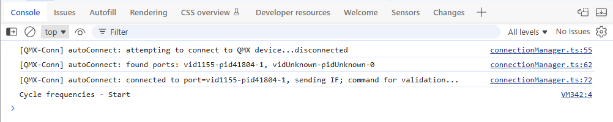
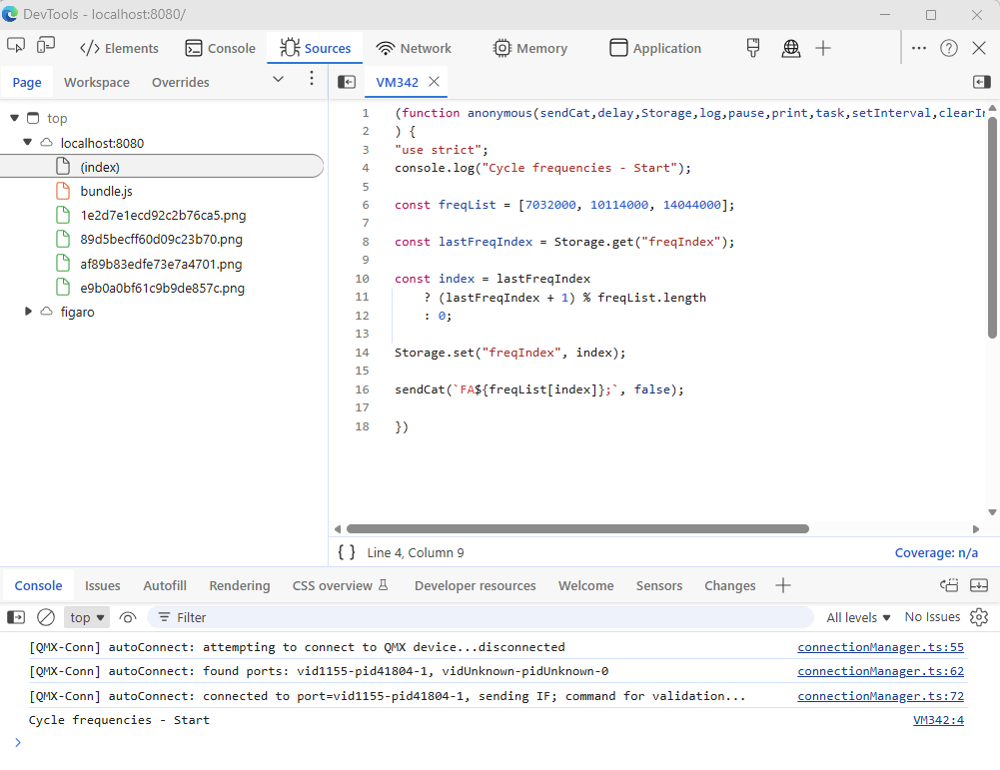

# Debugging

As your scripts get more involved, you'll invariably find the need to debug 
them.  Fortunately some simple techniques will ease the burden.

## Pre-requisites

### Figaro:Web
Ensure you've reviewed the **[Setup](setup)** page, and that you're working with
the web version of Figaro.

### DevTools
If you've not used your browser's dev-tools before, watch this quick 
[Google primer](https://www.youtube.com/watch?v=t1c5tNPpXjs).  It's not hard, 
you just need to be familiar with it.

<iframe width="560" height="315" src="https://www.youtube.com/embed/t1c5tNPpXjs?si=01Ak3UbHoQ-59O52" title="YouTube video player" frameborder="0" allow="accelerometer; autoplay; clipboard-write; encrypted-media; gyroscope; picture-in-picture; web-share" referrerpolicy="strict-origin-when-cross-origin" allowfullscreen></iframe>

## Write > Run > Debug workflow

#### Write
I strongly recommend that you write your scripts in a text editor with syntax
highlighting.  Create a new file with a `.js` extension to work within.

#### Run
`CTRL + A`, `CTRL-C` to copy your script, right click your task to edit, and 
`CTRL-V` to paste.  Then save and run the script.

#### Debug
Use DevTools to debug as required.

:::note

At times, if you find your script has failed spectacularly (such fun!), and hasn't 
cleaned up correctly, tasks may continue running in the background.  So when
things seem beyond odd, refresh your browser to ensure you're working with a 
clean slate.

:::


## Setting breakpoints


As Figaro uses dynamic scripts, you can't simply open the file in your browser's
Development Tools interface.  Instead we need to create a marker with which we
can open the dynamic scripts.  We do that with script comments.  Let's use 
a script which cycles frequencies each time it's run.

```js title="Monitor frequencies" showLineNumbers
// highlight-next-line
console.log("Cycle frequencies - Start");

const freqList = [7032000, 10114000, 14044000];

const lastFreqIndex = Storage.get("freqIndex");

const index = lastFreqIndex 
    ? (lastFreqIndex + 1) % freqList.length
    : 0;

Storage.set("freqIndex", index);

sendCat(`FA${freqList[index]};`, false);
```

Now open your browser's Developer Tools and make the console visible by either
visiting the console tab, or enabling the gutter view.

Run the script, and look in the console output for our comment.



As per the image above, we can see our comment, with the source link on the: 
right `VM342:4`.  By clicking on the source link, our script source will be
loaded.



Now that your script is available in the debugger, you can set break-points
and walk through your code.

Of course you could use the `debugger` command in your script, but I find that 
most inconvenient as your script will hit the breakpoint ON-EVERY-RUN.  To me, 
the console approach is far more elegent.

:::note

Every time you update your script, the dynamic script location will change, and 
you'll need to click on your comment again to access it.

:::

### Congratulations
Like most software developers, you too can now spend more time debugging than
writing code.

